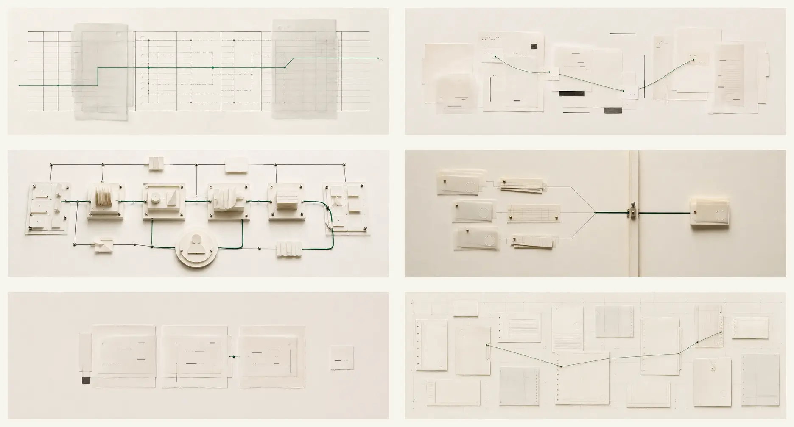

# Accounting Agents editorial image system

Six original, text-free header images generated for the public field guide. Production files are 1,800 × 600 progressive JPEG assets in `public/images/editorial/`.

The companion [additional-options portfolio](./editorial-image-options.md) provides sixteen more production-ready concepts without changing the original live placements.

## Visual language

- Ivory paper and translucent vellum
- Thin charcoal rules and registration marks
- One restrained forest-green path (`#176b4d` range)
- Top-down or slightly elevated photographed-paper construction
- Quiet institutional tone with generous negative space
- No robot, brain, coin, calculator, dashboard, neon, or science-fiction imagery

Images sit in their own bordered field. Do not place body copy over them, add gradients, or use more than one header image on a page.

## Asset map

| Asset | Primary placement | Reuse when useful | Accessible description |
|---|---|---|---|
| `01-ledger-topology.jpg` | Overview | Fundamentals, workflow library | Layered paper ledgers connected by a restrained green review path. |
| `02-evidence-archive.jpg` | Reading room | Research collections | An archive of research papers linked by a green evidence thread. |
| `03-agent-architecture.jpg` | System architecture | Evaluation, pilot design | Paper modules connected through tools and a central human review point. |
| `04-control-boundary.jpg` | Controls and authority | Authority levels, sensitive actions | Evidence packets pause at a physical approval boundary before continuing. |
| `05-workpaper-review.jpg` | Evidence and assurance | Operations, review guidance | Reviewed workpaper packets align while one unresolved item remains separate. |
| `06-global-practice.jpg` | Source library | Tax and public-sector material | International filing formats arranged on a shared coordinate grid. |

## Prompt set

All six assets used the built-in image-generation workflow.

### 01 — Ledger topology

> Ultra-wide editorial website header. Abstract physical ledger topology suggesting accounting records becoming a supervised agent system. Off-white paper field, precise charcoal ledger rules and tabular fragments without legible text or numbers, one restrained forest-green path, translucent vellum layers, punched registration marks, subtle paper grain, crisp Swiss editorial composition, matte photographed-paper realism, generous negative space. No robots, brains, people, glowing science fiction, dashboards, coins, calculators, logos, watermark, or embedded text.

### 02 — Evidence archive

> Exact 3:1 editorial reading-room header. Abstract evidence archive made from overlapping ivory research papers, index tabs, citation cards, thin charcoal rules, redaction-like blocks without legible text, and one forest-green archival thread linking selected source cards. Top-down, restrained Swiss editorial art direction, matte paper and vellum, precise alignment with slight human imperfection, generous negative space. No bookshelves, desk stock photography, people, robots, science fiction, dashboards, logos, watermark, or embedded text.

### 03 — Agent architecture

> Ultra-wide editorial header about agent architecture. Disciplined modular topology built from ivory paper modules, charcoal connectors, steel pins, and one forest-green route passing through bounded tool stations and returning to a review checkpoint. Physical paper-engineering and museum-catalog aesthetic, slightly elevated view, matte surfaces, crisp geometry, subtle grain, generous negative space. No text, labels, arrows, robots, brains, neural-network cliché, science fiction, dashboards, logos, coins, calculators, or watermark.

### 04 — Control boundary

> Exact 3:1 editorial header about controls and authority. Ivory workpaper field divided by a narrow physical approval boundary. Evidence cards and calculation slips approach the boundary, a forest-green route pauses at a small mechanical checkpoint, and only an approved packet continues. Thin charcoal rules, vellum, pins, subtle embossing, matte photographed-paper realism, Swiss museum-catalog composition, generous negative space. No legible text or numbers, arrows, people, hands, robots, brains, locks, shields, traffic lights, science fiction, dashboards, logos, coins, calculators, or watermark.

### 05 — Workpaper review

> Exact 3:1 editorial header about human review and accountable judgment. Three ivory evidence packets, a translucent review overlay aligning across them, small charcoal registration marks, and one forest-green review pin joining support to conclusion; one unresolved fragment remains offset outside the reviewed packet. Top-down matte paper and vellum, Swiss editorial restraint, generous negative space. No legible text or numbers, hands, people, faces, check marks, rubber stamps, robots, brains, science fiction, dashboards, logos, coins, calculators, or watermark.

### 06 — Global practice

> Exact 3:1 editorial header about international accounting, audit, tax, and professional standards. An abstract atlas of differently proportioned ivory regulatory papers and filing forms across a faint charcoal coordinate grid, connected selectively by one forest-green thread. Suggest jurisdictions through paper formats, tabs, seals, and alignment conventions without flags, country outlines, or readable language. Top-down matte paper and vellum, Swiss editorial restraint, fine grain, generous negative space. No legible text or numbers, globes, flags, maps, money, coins, calculators, robots, brains, science fiction, dashboards, logos, or watermark.
