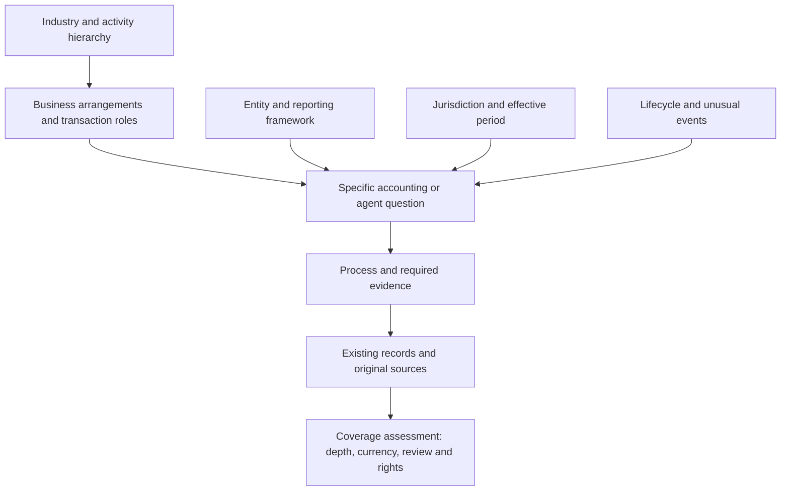

# Accounting research coverage topology

NAICS is a suitable backbone for systematically scoping US industry coverage. It should sit inside a broader map that connects economic activities to accounting questions, business arrangements, reporting frameworks, jurisdictions, effective periods and evidence. SIC remains useful for finding SEC filings and older material. Neither classification, by itself, defines the accounting knowledge needed to build accounting agents.

The strongest practical starting point is **all 20 sectors and 96 subsectors of NAICS United States 2022, with all 1,012 detailed US industries retained for exception review**. This report's companion map enumerates that entire industry hierarchy. It also proposes **62 accounting and agent question families**, **30 reusable business-model archetypes**, and a specific research prompt for every subsector. These additions establish a research denominator and a worklist. They do not establish that the corpus covers those subjects adequately.[^1][^2]

The appropriate completeness target is therefore layered: enumerate every industry; assess which questions apply; identify and evaluate the relevant evidence; then verify depth, currency and rights for an explicit scope. A single percentage labeled “accounting coverage” would conceal too much. The current corpus's overall accounting coverage remains **unmeasured**, even though the industry inventory in this research package is complete for the selected classification edition.

The scope is US-first and globally extensible, with a research cutoff of September 11, 2026. The deliverables are a [detailed worklist](accounting-coverage-topology-worklist-2026-09-11.md) and a [machine-readable map](accounting-coverage-topology-2026-09-11.json). They are research artifacts; they have not been integrated into the corpus's public filters or presented as professionally reviewed accounting guidance.

## The construction result and the existing corpus

The earlier construction review identified 23 areas requiring construction-specific treatment. Those were not 23 wholly new branches of accounting. Several already had generic foundations: revenue, payables, leases, estimates, treasury, tax and consolidation. The missing layer was the connection between those subjects and a contractor's actual contract, job-cost, WIP, billing, labor and jurisdictional questions. That distinction matters because an industry taxonomy can expose overlooked sectors while still missing important depth inside a sector already represented.[^3]

For example, a general revenue reference does not, by itself, answer which costs belong in a project's progress measure, how forecast revisions affect the WIP analysis, or how retainage differs from an unconditional right to payment. Conversely, an industry-specific discussion should not duplicate the entire general revenue literature. The coverage map needs to connect a shared foundation with the additional questions created by the industry, contract and reporting facts.

The local corpus snapshot contains 838 records, including 577 sources, 73 workflows, 35 collections and 17 guides. It has 25 distinct topic labels and 12 industry labels. Of the 838 records, 648, or approximately 77.3%, have no industry tag. These figures come directly from the canonical files; the companion JSON records their hashes so the snapshot can be distinguished from later changes.[^4]

| Existing industry label | Tagged records | Interpretation for topology work |
|---|---:|---|
| General | 81 | A starting pool for shared foundations; applicability still requires assessment |
| Construction and real estate | 61 | Recent construction expansion; contractor coverage must not be transferred automatically to property owners or developers |
| Banking and credit unions | 13 | Mix of accounting, supervision, AI governance and datasets |
| Public sector and nonprofit | 13 | Several reporting regimes and entity forms are combined |
| Asset management and capital markets | 5 | Accounting relevance varies across market, technical and governance material |
| Healthcare and life sciences | 5 | Hospital cost-reporting material does not establish pharmaceutical or every care-provider branch |
| Insurance | 5 | Useful starting references across distinct reporting contexts |
| Manufacturing | 3 | Includes engineering, security and vendor material; count does not measure manufacturing accounting depth |
| Technology and SaaS | 2 | Cloud-cost and customer implementation material does not establish software-provider revenue coverage |
| Energy and utilities | 2 | Regulated utility material cannot be assumed to cover extraction or every energy business |
| Retail and consumer | 2 | A narrow starting inventory |
| Digital assets | 2 | A cross-industry instrument or activity dimension as well as a discovery label |

Labels can overlap, and these categories are not comparable units. Construction and real estate span different activities; public-sector and nonprofit labels combine ownership and reporting attributes; digital assets can appear across many industries. Missing tags are **unclassified applicability**, not proof that 648 records lack industry relevance. The first mapping pass should inspect existing content before commissioning more source collection.

The record-level review inventory is also separate from coverage: 89 records are marked source-checked, 34 editorially reviewed, 695 inherited-not-reverified and 20 inherited-curation-not-reverified. These statuses preserve what was reviewed. They do not answer whether a particular industry-question combination has adequate evidence, and they do not establish professional verification.[^4]

## The classification choices

NAICS classifies establishments by economic activity for statistical purposes. It was developed jointly for North America and replaced SIC in the US federal statistical system. An establishment classification is a useful way to enumerate businesses to examine; it is not a determination of an enterprise's accounting policies or the scope of a reporting standard.[^1]

| System | Best use in this corpus | Principal limitation | Recommendation |
|---|---|---|---|
| NAICS United States 2022 | Detailed, versioned US activity inventory | Establishment activity does not determine the accounting answer | Primary US industry backbone |
| SIC as used by the SEC | EDGAR discovery and compatibility with older sources | Different classification purpose and granularity | Preserve as an external cross-reference |
| ISIC Revision 5 | International activity spine and national-classification bridges | Local adoption and correspondence require separate checks | Global extension layer |
| NACE Revision 2.1 | EU activity classification | Edition and statistical-period transitions matter | EU regional bridge |
| ASC, IFRS and other reporting-standard structures | Accounting subject and authority maps | Each has a defined reporting scope; none covers every tax, operating or agent question | Parallel accounting and framework dimensions |
| APQC Process Classification Framework | Process decomposition and external completeness challenge | Framework-specific reuse terms require examination | Comparison reference; retain an original process vocabulary |
| SASB's SICS | Example of grouping businesses by shared subject-specific risks | Its purpose is sustainability-related risks and opportunities | Design analogy and optional sustainability branch |
| Financial reporting XBRL taxonomies | Concepts, disclosures, data structures and version changes | Reporting outputs do not describe the entire upstream accounting process | Output and interoperability cross-reference |

### NAICS and SIC

The official Census workbook contains 20 sectors, 96 subsectors, 308 industry groups, 689 five-digit NAICS industries and 1,012 six-digit US industries. The hierarchy therefore has 2,125 nodes across its five levels. The companion map preserves codes as text, including the combined sectors `31-33`, `44-45` and `48-49`, and retains immediate parent relationships. Those ranges must not be mistaken for five-digit industries.[^2]

The proposed working granularity is the subsector. Twenty sectors are too broad for an accounting research agenda, while starting with 1,012 independent literature reviews would duplicate substantial work. All detailed industries should nevertheless remain visible. A subsector is complete only after its detailed branches have been inspected for differences that invalidate a shared treatment.

For example, manufacturing includes food, chemicals, electronics, vehicles and many other branches. Even a well-developed manufacturing foundation will need different questions for perishability, licensed technology, complex production programs or environmental obligations. These are proposed screening distinctions, not automatic conclusions about which accounting rule applies.

Census currently presents the 2022 reference system alongside a July 13, 2026 notice requesting comments on proposed 2027 revisions. That notice describes proposed changes and a prospective 2027 application. The research map therefore pins the established 2022 edition rather than silently mixing proposed codes into it. A future migration should preserve both versions and document splits, mergers and changed meanings.[^5]

SIC should remain available because the SEC uses SIC codes in EDGAR to indicate companies' business types and help assign disclosure-review responsibility. This is an operational reason to retain SIC when searching filings. It does not require organizing the new research universe around SIC. Store the supplied SEC code and its source, then map it to other schemes only through an evidenced correspondence.[^6]

### International extension

UNSD describes ISIC as an internationally agreed classification of economic activities. Its current page states that Revision 5 was endorsed by the UN Statistical Commission in 2023; the publication is forthcoming, with structure and explanatory material already available. The status of the international classification should be kept separate from a country's adoption or a dataset's actual coding edition.[^7]

Eurostat identifies NACE Revision 2.1 as the version for European statistics from 2025 onward, with transition arrangements and correspondence tables. Accordingly, an EU source should retain its actual NACE edition and reference period. Mapping a 2024 dataset and a 2026 dataset under an unversioned “NACE” label could conceal changed classifications.[^8]

The global design should support several country systems alongside ISIC, rather than replacing the US hierarchy prematurely. Every mapping needs the source scheme, target scheme, both editions, relation type, publisher or reviewer, and evidence. The companion JSON names the intended bridges but does not fabricate a complete NAICS–ISIC–NACE–SIC crosswalk.

The classification unit also matters. One corporate group can contain manufacturing, financing, leasing and service activities. A privately operated company can receive public contracts, and a public entity can deliver education or healthcare. NAICS explicitly includes different ownership and profit forms within educational services. Industry, ownership and reporting framework must therefore remain separate dimensions.[^9]

## The broader accounting map

The recommended structure is a set of connected dimensions. Each dimension answers a different question about the material to retrieve. A reader can begin with an industry, an accounting issue or a business fact and reach the same supporting records.

### Accounting subjects and business processes

FASB's Codification offers a useful structural precedent: general topics, broad transactions and industry guidance coexist. Industry material supplies incremental guidance alongside other relevant topics. The Codification also distinguishes topic, subtopic, section and paragraph, including sections for scope, recognition, measurement and disclosure. Its scope is nongovernmental US GAAP; its own description excludes governmental standards and several other accounting bases.[^10]

The corpus should adopt the principle of shared foundations plus conditional additions, while keeping its broader mission. Financial accounting is only part of that mission. Tax, payroll, management accounting, audit, controls, source data, agent architecture, empirical evidence and reuse rights also need a place. These subjects cannot all be recovered by walking an industry list or a financial-statement taxonomy.

The 62 proposed question families are grouped as follows. The full questions and stable identifiers are in the worklist and JSON.

| Question group | Included subjects |
|---|---|
| Reporting foundations | Reporting basis, close, estimates, presentation, foreign currency, changes and errors, subsequent events, consolidation |
| Operating transactions | Customer revenue, project WIP, purchasing and payables, receivables, cash settlement, inventory |
| Assets and workforce | Capital assets, leases, intangibles and software, payroll, employee benefits |
| Capital and financing | Debt, equity, share compensation, investments, derivatives, valuation and impairment, digital assets |
| Tax and filing obligations | Income tax, indirect and customs taxes, entity/individual/information returns, cross-border tax, tax methods |
| Entity changes and unusual events | Combinations, related parties, provisions, purchased insurance, distress and disposals, environmental obligations |
| Institutional and regulated arrangements | Grants, government funds, federal reporting, insurance obligations, lending, custody and funds, rates, natural resources, reimbursement, licensed content |
| Management accounting | Cost allocation, budgets and forecasts, profitability and performance measures |
| Assurance and controls | Audit assertions, control and fraud, compliance assurance, professional and engagement duties |
| Agent, data and research evidence | Lineage, interfaces, security, agent design, human authority, evaluation, deployment evidence, rights |

These groups are an original initial decomposition, not a claim that accounting contains exactly 62 indivisible subjects. They should be challenged against the existing 73 workflows, reporting-standard indexes, tax and regulatory obligations, real business fact patterns, and questions submitted by corpus users. A new family should be added when a material question has no sensible home; a family should be split when its internal distinctions prevent useful assessment.

Process is a separate route through the same material. “Procure to pay” might involve inventory, assets, indirect tax, payables and payment authority. “Period close” might involve every major balance and disclosure. Existing process and workflow IDs can remain stable while connecting to several question families. Payroll and benefits, management costing, and institution-specific reporting deserve explicit screening even where the current process labels do not name them.

APQC's current PCF material identifies Version 8.0 and supplies cross-industry and industry-specific process frameworks. It is valuable as an external challenge to a process map. Its general terms restrict redistribution absent applicable permissions, while other APQC material describes a broader PCF license. The exact version-specific grant would need to be established before importing that framework into an openly reusable corpus. This package links to APQC and uses original question families; it does not copy the PCF hierarchy.[^11][^12][^13]

### Business arrangements and roles

Thirty proposed archetypes connect industry activity to recurring accounting patterns. Examples include project contracting, manufacturing conversion, wholesale distribution, marketplaces, subscriptions, fleet transport, content licensing, credit intermediation, insurance risk pooling, property development, fiduciary investment, education, clinical reimbursement and public finance. The archetypes are nonexclusive: an entity can need several, and the same pattern can appear in different industries.

This prevents the classification from obscuring important roles. An insurer and an insurance broker do not bear the same obligations. A property developer, landlord, manager and broker need different questions. A healthcare provider and a pharmaceutical manufacturer should not inherit one undifferentiated “healthcare” package. A software customer and software provider may appear near the same terminology while facing different accounting questions.

SASB's description of SICS provides a relevant analogy: it groups companies by shared sustainability-related risks and opportunities, and recognizes the need to consider multiple industry standards. The proposal here uses shared accounting arrangements as an additional research lens. It does not repurpose sustainability classifications as financial-accounting authority.[^14]

Archetypes should produce **candidate questions**, not automatic answers or exclusions. A “transport” profile can suggest leases, fleet assets, freight cutoff and fuel costs. It cannot establish that a particular contract is a lease, that the entity owns the fleet, or that every transport company has the same obligations. Applicability is decided later, against documented facts.

### Entity, framework, jurisdiction and period

An industry node cannot determine the applicable reporting framework. The map should record legal form, profit or nonprofit purpose, ownership, issuer status, size or eligibility conditions, regulatory status, group role and fiduciary role independently. Accounting basis is another attribute: US nongovernmental GAAP, state and local governmental GAAP, federal GAAP, IFRS as locally adopted, other national frameworks, insurer statutory accounting, tax basis and other special-purpose bases all need distinct routes.

The authoritative collections are different. GASB's research system concerns US state and local governmental GAAP. FASAB's handbook concerns federal entities and identifies later pronouncements outside the current compilation. IFRS's Navigator provides IFRS Accounting Standards and related material, with its own access and licensing conditions. IPSASB's current 2026 handbook supplies a further public-sector reference universe. Naming a framework is not evidence that a specific entity is required or permitted to use it.[^15][^16][^17][^18]

Jurisdiction should be recorded by role rather than compressed into one place name. Formation, tax residence, sales-tax nexus, worker location, asset location, contract governing law, financial-reporting jurisdiction and data rules can differ. “United States” is a useful starting filter but cannot resolve state or local obligations. “Global” can describe the reach of research without making it an authority applicable everywhere.

Time needs equally explicit treatment. Publication date, effective date, financial period, contract or transaction cohort, adoption date, supersession date and source-check date answer different questions. The construction review's tax-transition issue illustrates how these distinctions affect retrieval. A page checked today can still concern an older regime. A newly issued standard can concern future periods. Coverage should identify the period actually supported.

### Evidence, controls and agent research

For each substantive question, the map should ask what evidence would be needed to use the answer. The proposed depth dimensions are scope; supported treatment or finding; required evidence inputs; workflow and reconciliation; controls and failure modes; usable examples or data; and empirical support where a performance claim is made. Different kinds of research need different acceptance criteria. A legal scope reference does not need an agent deployment study to be useful, but it cannot establish agent performance.

PCAOB AS 1105 is a useful check on the evidence dimension. It distinguishes assertions such as completeness, existence, rights, valuation and presentation, and recognizes both supporting and contradictory evidence. Those categories help prevent a corpus from accumulating plausible calculations while overlooking missing populations or unsupported rights. They are used here as a scoping reference, not as a claim that every corpus user is conducting a PCAOB audit.[^19]

Financial reporting taxonomies add another useful route. The 2026 FASB taxonomy release notes describe new elements, changes and deprecations linked to reporting developments. Such concepts can connect a question to disclosure and data outputs. The inference for this corpus is narrower: output concepts can help check disclosure coverage, but they cannot enumerate all upstream contracts, payroll obligations, controls or system evidence.[^20]

Agent research should remain anchored to these accounting questions. General retrieval, planning or security papers can be shared foundations. Their transfer to a particular accounting task should be stated as an inference unless tested. A synthetic task result, a vendor deployment story, an independent field study and professional accounting review are different evidence forms; none should silently substitute for the others.

## Industry coverage worklist

The full companion worklist gives every one of the 96 subsectors a research prompt and a count of its detailed industries. The following view summarizes the kinds of differences that the sector sweep should expose. These are proposed investigations, not findings that all the listed material is absent.

| NAICS sector | Accounting distinctions to investigate |
|---|---|
| 11 Agriculture, forestry, fishing and hunting | Growing versus harvested resources, production cycles, quotas, depletion, cooperatives and seasonal tax questions |
| 21 Mining, quarrying, oil and gas | Exploration and development stages, reserves, royalties, production costs and restoration |
| 22 Utilities | Tariffs, usage, regulated recovery, infrastructure and public/private ownership |
| 23 Construction | Contractor versus developer roles; residential, commercial, civil and trade differences; WIP, claims and public procurement |
| 31–33 Manufacturing | Conversion costs, yields, overhead, tooling, research, warranties and product-specific obligations |
| 42 Wholesale | Inventory ownership, consignment, rebates, returns, agency roles and financing |
| 44–45 Retail | Point-of-sale completeness, promotions, gift cards, returns, shrinkage, marketplace settlement and indirect tax |
| 48–49 Transportation and warehousing | Freight and passenger cutoff, fleets, charters, maintenance, customer goods and public-service arrangements |
| 51 Information | Software, subscriptions, content rights, royalties, advertising, usage networks and data-center commitments |
| 52 Finance and insurance | Credit, servicing, deposits, underwriting, reinsurance, custody, funds and supervisory reporting |
| 53 Real estate and rental | Development inventory, owner assets, landlord obligations, rental fleets, brokerage and intangible rights |
| 54 Professional and technical services | Retainers, time and milestones, client funds, reimbursable costs, intellectual property and professional duties |
| 55 Management of companies | Reporting perimeter, holding entities, shared services, related parties and internal funding |
| 56 Administrative support and waste | Staffing and agency roles, customer funds, service contracts, disposal and remediation |
| 61 Education | Tuition, aid, sponsored research, contributions, endowments and ownership-dependent reporting |
| 62 Healthcare and social assistance | Third-party reimbursement, claims, settlements, cost reports, eligibility, care services and restricted funding |
| 71 Arts, entertainment and recreation | Admissions, media rights, sponsorships, prizes, collections, member and participant funds |
| 72 Accommodation and food services | Owner/operator/franchise roles, reservations, deposits, tips, delivery platforms and food costs |
| 81 Other services | Repair obligations, prepaid services, dues, contributions, organizational form and household employment |
| 92 Public administration | Government level, funds, appropriations, taxes, transfers, administered programs and stewardship |

Heterogeneous and residual categories deserve deliberate review. “Other services” cannot be signed off after one generic service-business source. Likewise, one credit-loss paper cannot close finance and insurance, and one hospital cost-report manual cannot close healthcare and social assistance. The detailed leaves are useful precisely because they challenge a comfortable but overbroad parent summary.

The 23 construction areas have also been mapped to the new question families and their existing workflow IDs. This shows how the proposed structure can reuse actual corpus content. It is a candidate mapping: the prior review's remaining gaps, dated-source limitations and lack of professional sign-off remain in force.

## Measuring progress toward completeness

There are at least four different denominators. The industry denominator can be fixed externally. The question denominator is an editorial design that must be versioned. Applicability depends on declared facts. Evidence sufficiency depends on a stated acceptance standard. Keeping those distinctions explicit makes progress measurable without manufacturing a global completeness score.

| Measure | Denominator | What can be reported now |
|---|---|---|
| Industry enumeration | All nodes in NAICS-US 2022 | 20/20 sectors, 96/96 subsectors and 1,012/1,012 detailed industries inventoried |
| Subsector research prompts | All 96 subsectors | 96/96 have original screening prompts |
| Applicability assessment | Defined industry-question screening universe | Not completed; 5,952 candidate pairs arise from 96 subsectors × 62 question families |
| Answer and evidence coverage | Scoped, versioned question set with explicit acceptance criteria | Not yet measured |
| Detailed-industry exception review | All 1,012 detailed industries | Not yet assessed in this research package |
| Currency and reuse readiness | Evidence relied on for a particular period and use | Must be evaluated at source and claim level |

The 5,952 pairs are a **screening workload**, not a claim that 5,952 unique research topics or articles are required. Shared questions can be answered once and reused with a justified scope. Some combinations will be irrelevant; others will expand into many questions. Entity, jurisdiction and event variants should be created where they change an answer, rather than generating every possible combination mechanically.

A useful assessment unit is an answerable question for a declared profile. “Revenue in construction” is too broad. A question about a particular kind of contract, reporting basis, progress method, jurisdiction and period is assessable. The record needs an applicability rationale, supporting source locators, relevant corpus IDs, known exceptions, remaining gaps, review basis and currency information.

Use separate status dimensions. Applicability can be unassessed, applicable, conditional or reviewed as not applicable. Evidence can be unassessed, searched without a suitable result, candidate-only, source-checked, a sourced answer, or workflow-supported. Professional review, empirical replication, source currency and reuse permissions should remain separate. These categories prevent a reachable URL from appearing equivalent to a usable, current answer.

For a frozen set of scoped questions, report the number meeting the declared evidence criterion over the complete set after justified, reviewed exclusions. Show unassessed and unresolved conditional questions alongside that measure. Do not compute a flattering percentage only over the questions already researched. If the reporting scope or question inventory changes, issue a new denominator version and explain the change.

“No suitable source found” also requires evidence of a search; it is not the default state of an empty cell. “Not applicable” needs a reason and scope. A broad parent reference should remain candidate material until the relevant question has been checked. These rules are what keep an exhaustive-looking taxonomy from becoming an unsupported coverage claim.

## Implementation and research sequence

The first step is to use the companion map as a research control file while preserving the canonical record contract. Stable record IDs need not change. An eventual implementation can add versioned taxonomy and assessment files, then expose the relevant relationships through existing retrieval and exports. There is no need to turn the corpus into an execution platform or a new benchmark product.

The suggested sequence is:

1. **Map and challenge shared foundations.** Inspect the 838 existing records, including untagged material, against the 62 proposed families. Resolve where generic workflow coverage is sufficient and where payroll, benefits, costing, financing, entity events or other subjects need more depth. Add precise applicability instead of bulk-tagging every general source to every industry.
2. **Test contrasting operating models.** Review manufacturing, wholesale/retail, software and professional services. These are useful next comparisons because they challenge the construction model through inventory conversion, distribution, subscriptions and labor-based projects. Priority here is an editorial judgment about breadth and reuse, not an economic ranking.
3. **Extend asset and service models.** Examine property, transport, hospitality, agriculture and extraction. Separate ownership, lease roles, resource stages, perishability, fleets and site obligations.
4. **Deepen institutional regimes.** Review financial institutions, healthcare, education, nonprofits and government with distinct framework and regulatory profiles. Reuse the specialist references already present, while checking their exact scope and period.
5. **Close the residual inventory and extend globally.** Visit every remaining subsector, inspect all detailed-industry exceptions, then expand through evidenced international and jurisdictional mappings. Keep unusual and residual branches in the denominator even if they receive lower initial priority.

Each industry review should yield a concise applicability profile, a set of specific questions, candidate and accepted sources, links to reusable foundations, identified exceptions and a recorded gap statement. A source-heavy industry package is not complete merely because it is larger than another. Completion should depend on the question set and its evidence criteria.

A sample of reviews should challenge the map from the opposite direction. Start with an unfamiliar business or transaction and determine whether the taxonomy finds all material research branches. A manufacturer that leases assets, provides financing, operates abroad and acquires another entity is a better challenge than a single-industry label alone. Newly discovered questions should revise the map, with the denominator change retained in history.

Relationships should distinguish broader, narrower, related and equivalent concepts. W3C's SKOS vocabulary provides established distinctions for this purpose, including cross-scheme mappings. A small JSON representation can preserve those semantics without requiring a graph database or RDF infrastructure. A shared label is insufficient evidence for an exact match.[^21]

## Deliverables, limits and decision

The machine-readable artifact includes the full 2,125-node NAICS-US 2022 hierarchy, original subsector prompts, 62 question families, 30 archetypes, candidate links to existing records, 23 construction mappings, scope dimensions, proposed assessment states, a research sequence and a hashed local corpus snapshot. It explicitly leaves overall accounting coverage unknown and international crosswalks unverified. The human-readable worklist exposes the research questions without requiring a reader to inspect the JSON.

The strongest verified result is the industry inventory. The principal analytical result is a proposed method for turning that inventory into meaningful accounting coverage. The research does not certify a complete accounting ontology, perform 1,012 industry reviews, establish a 50-state or worldwide obligation inventory, or reverify all existing source records. Those are identifiable next layers of work rather than hidden assumptions inside a percentage.

The recommended decision is to **adopt NAICS-US 2022 for the US industry inventory and use the 96-subsector worklist to drive a multi-dimensional coverage assessment**. Preserve SIC for SEC discovery and prepare versioned ISIC/NACE bridges. Judge progress by scoped questions answered with adequate evidence, while keeping unassessed territory visible. That provides a defensible path toward exhaustive coverage and a mechanism for discovering the next set of gaps after construction.

## Sources

All live references below were consulted for this report's September 11, 2026 research cutoff. A consultation date is not a determination that every linked requirement is effective for every entity or period.

[^1]: U.S. Census Bureau. [North American Industry Classification System](https://www.census.gov/naics/). Current landing page, consulted September 11, 2026. Used for the system's purpose, unit of classification and relation to SIC.
[^2]: U.S. Census Bureau. [2022 NAICS Structure](https://www.census.gov/naics/2022NAICS/2022_NAICS_Structure.xlsx). 2022 edition, downloaded September 11, 2026. Used for all classification codes, titles, parents and counts. The companion JSON preserves the downloaded file's SHA-256 and extraction details.
[^3]: Accounting Agents. [Construction accounting coverage review](construction-accounting-coverage-2026-09-11.md). September 11, 2026. Local project research; used for the 23-area example and its evidence limitations.
[^4]: Accounting Agents. Canonical [catalog](../../data/catalog.json) and [corpus files](../../data/corpus). Local version `2026-09-11.1`, inspected September 11, 2026. Used for record, topic, industry and review-state counts. File-level hashes appear in the companion JSON.
[^5]: Office of Management and Budget. [Statistical Policy Directive No. 8: NAICS—Request for Comments on Proposed Updates for 2027](https://www.govinfo.gov/content/pkg/FR-2026-07-13/pdf/2026-14086.pdf). Federal Register, July 13, 2026, pp. 42976–42981. Used to distinguish the proposed 2027 revision from the pinned 2022 inventory.
[^6]: U.S. Securities and Exchange Commission. [Standard Industrial Classification (SIC) Code List](https://www.sec.gov/search-filings/standard-industrial-classification-sic-code-list). Consulted September 11, 2026. Used for EDGAR's continued use of SIC and its disclosure-review role.
[^7]: United Nations Statistics Division. [International Standard Industrial Classification of All Economic Activities](https://unstats.un.org/unsd/classifications/Econ/ISIC). Current Revision 5 information, consulted September 11, 2026. Used for international scope, the stated 2023 endorsement and available pre-publication formats.
[^8]: Eurostat. [NACE overview](https://ec.europa.eu/eurostat/web/nace/overview). Consulted September 11, 2026. Used for Revision 2.1, the 2025-onward statistical reference periods and transition/correspondence resources.
[^9]: Office of Management and Budget. [North American Industry Classification System, United States, 2022](https://www.census.gov/naics/reference_files_tools/2022_NAICS_Manual.pdf). Sector 61, printed p. 509. Used for the inclusion of different ownership and profit forms in educational services. The manual is referenced, not redistributed.
[^10]: Financial Accounting Standards Board. [About the Codification, version 5.11](https://asc.fasb.org/layoutComponents/getPdf?fileName=FASB_About_the_Codification.pdf&isSitesBucket=true). February 2023, pp. 4 and 8–11. Used for Codification scope, hierarchy and incremental industry guidance; not as verification of current substantive GAAP for a transaction.
[^11]: APQC. [Process Frameworks](https://www.apqc.org/process-frameworks) and [PCF Frequently Asked Questions](https://www.apqc.org/process-frameworks/pcf-faqs). Consulted September 11, 2026. Used for the process-framework role and Version 8.0 identification.
[^12]: APQC. [Terms of Service](https://www.apqc.org/terms-of-service). Consulted September 11, 2026, Limited License and Use of Online Resources sections. Used to identify the need to establish an applicable grant before redistribution or AI reuse.
[^13]: APQC. [What Are the Main Types of Core Business Processes and How Do They Impact Overall Performance?](https://www.apqc.org/What-Are-the-Main-Types-of-Core-Business-Processes-and-How-Do-They-Impact-Overall-Performance). Consulted September 11, 2026. Describes a broader PCF license; retained alongside the general terms rather than treating either statement as a verified license for an uninspected framework file.
[^14]: IFRS Foundation. [Understanding SASB Standards](https://www.ifrs.org/issued-standards/sasb-standards/understanding-sasb-standards/). Consulted September 11, 2026, “Determine which industry standards apply.” Used for SICS's subject-specific grouping and multi-industry applicability analogy.
[^15]: Governmental Accounting Standards Board. [Governmental Accounting Research System](https://gars.gasb.org/). Publisher-indexed description consulted September 11, 2026; the application itself did not expose readable standards in this review. Used only to identify the state/local GAAP reference system.
[^16]: Federal Accounting Standards Advisory Board. [Standards & Guidance](https://fasab.gov/accounting-standards/). Consulted September 11, 2026. Used for federal reporting scope and the distinction between the current handbook and later pronouncements listed separately.
[^17]: IFRS Foundation. [IFRS Accounting Standards Navigator](https://www.ifrs.org/issued-standards/list-of-standards/). Consulted September 11, 2026. Used for the standards collection, access and licensing boundary; no complete standard text was imported.
[^18]: International Public Sector Accounting Standards Board. [Standards & Pronouncements](https://www.ipsasb.org/standards-pronouncements). Consulted September 11, 2026. Identifies the 2026 handbook, published August 17, 2026, with pronouncements published through January 31, 2026. Used for the public-sector reference universe, not national adoption claims.
[^19]: Public Company Accounting Oversight Board. [AS 1105: Audit Evidence](https://pcaobus.org/oversight/standards/auditing-standards/details/AS1105). Current page consulted September 11, 2026, paragraphs .02 and .11–.12. Used for supporting/contradictory evidence and assertion categories.
[^20]: Financial Accounting Standards Board. [2026 FASB GAAP Taxonomies Release Notes](https://xbrl.fasb.org/resources/annualrelease/2026/GAAP_Financial_Reporting_Taxonomy_Release_Notes.pdf). 2026 edition. Used for reporting-concept versioning, additions and deprecations.
[^21]: W3C. [SKOS Simple Knowledge Organization System Primer](https://www.w3.org/TR/skos-primer/). W3C Working Group Note, August 18, 2009, section 3.1. Used for distinctions among cross-scheme mapping relationships.
