# Content Audit: AI Agents in Accounting

**Repository reviewed:** `HenryBranchAdams/ai-agents-in-accounting`  
**Review date:** August 24, 2026  
**Scope:** Educational quality, editorial strategy, information architecture, reference usefulness, conceptual coverage, and field-building potential. Software implementation and code quality are intentionally excluded.

---

## Executive verdict

This is already a remarkably serious open corpus. Its strongest achievement is that it treats accounting agents as **governed accounting systems**, not as clever prompts. The site consistently connects agent work to evidence, control totals, authority, segregation of duties, review, workpapers, retention, and reproducibility. That gives it a level of accounting-native rigor that most AI-accounting material lacks.

The central weakness is almost the mirror image of that strength:

> **The site is currently better at specifying the field than teaching the field.**

It reads like a hybrid of a standards manual, domain ontology, control framework, API reference, and benchmark constitution. Those are valuable assets. But a newcomer still does not get to *experience* a complete accounting-agent workflow, and an experienced practitioner still has to translate many reference records into a practical operating design.

The next stage should therefore be **pedagogical conversion, not corpus expansion**. The project does not primarily need another 100 sources or 40 more workflow records. It needs to turn its existing intellectual assets into:

1. guided learning experiences;
2. decision-oriented playbooks;
3. deeply worked accounting cases;
4. more workflow-specific guidance;
5. a connected evidence and workflow atlas;
6. role-specific entry points;
7. concise synthesis of what the field currently knows and does not know.

A useful positioning statement would be:

> **Accounting Agents is the open field guide and reference corpus for AI systems that perform accounting work without erasing evidence, authority, controls, or human accountability.**

That sentence captures the project’s real differentiation more clearly than a list of corpus components.

---

## Qualitative scorecard

| Dimension | Score | Assessment |
|---|---:|---|
| Accounting-native framing | 9.5/10 | Evidence, workpapers, control totals, approvals, retention, and accountable ownership are integral rather than decorative. |
| Governance and authority | 9.5/10 | The A0–A4 model, human-only boundaries, sensitive-action treatment, and deterministic enforcement are unusually strong. |
| Source discipline | 9/10 | Sources are typed, caveated, jurisdiction-scoped, and separated from editorial synthesis. |
| Reference breadth | 8.5/10 | Sixty workflows, hundreds of sources, templates, packs, schemas, and benchmark records form a substantial corpus. |
| Conceptual coherence | 8/10 | The same operating principles recur throughout, although repetition now creates some redundancy. |
| Practical decision support | 6/10 | The material tells readers what a sound system contains, but not always how to make a concrete choice in a live implementation. |
| Discoverability | 6/10 | Navigation is comprehensive but corpus-led rather than question-led; source filtering and cross-linking remain basic. |
| Audience orientation | 4.5/10 | Accountants, engineering teams, executives, auditors, educators, and researchers receive mostly the same pathway and voice. |
| Pedagogical progression | 4/10 | Definitions and maps are strong, but there is little guided practice, scaffolding, assessment, or progressive mastery. |
| Worked examples | 3/10 | Synthetic packs exist, but the human-facing site does not yet teach through complete, annotated cases and finished workpapers. |
| Original field-building ideas | 8/10 | The authority model, evidence chain, commit boundary, work-record emphasis, and LedgerBench architecture are important original contributions that deserve more prominent explanation. |

---

## What should remain foundational

### 1. The operating rule

The sentence that agents may prepare work while accountable people approve conclusions and sensitive external actions is the project’s clearest organizing principle. Preserve it.

The improvement is not to repeat it on every adjacent page. State it once as the canonical rule, then make later pages demonstrate how it changes a bank reconciliation, journal entry, payment, filing, control test, and technical memo.

### 2. The authority model

The A0–A4 and human-only model is one of the project’s best original abstractions. It gives teams language for decomposing a workflow into separately authorizable actions rather than calling an entire system “autonomous.”

Preserve the taxonomy, but add:

- a one-page visual ladder;
- a decision tree;
- common misclassifications;
- comparisons with familiar approval and segregation-of-duties concepts;
- examples in which one workflow contains several authority levels;
- explanations of why model confidence never changes authority.

### 3. The evidence chain

The distinction among evidence, observation, claim, judgment, and decision is excellent. It should become a flagship teaching device rather than one table among many.

Use one recurring fact pattern across the site. Show how the same invoice, contract, bank record, or control artifact moves through the chain and where a human must intervene.

### 4. Workflow records as canonical contracts

The workflow pages have a disciplined shared structure: objective, inputs, tools, procedures, checks, authority, human decisions, outputs, failure modes, recovery, monitoring, and sources.

Keep this as the machine-readable and reference layer. Do not force it to carry the full educational burden.

### 5. Source provenance and limitations

The distinction among rules, official guidance, research, evidence, thought pieces, technical references, and practice examples is unusually responsible. Preserve the editorial skepticism, especially around vendor claims and transferability.

### 6. Honest benchmark boundaries

The project explicitly distinguishes a public conformance suite from broader accounting competence, field utility, and production readiness. That restraint is valuable and should remain central to LedgerBench.

### 7. Rights, review states, corrections, and versioning

These are easy to treat as administrative details, but they are part of why the corpus can become trusted infrastructure. Keep them visible, but move most rights and project-governance detail out of the primary learning journey.

---

## The central content problem: the four documentation modes are unbalanced

The site currently contains a great deal of **reference** and **explanation**, a smaller amount of **how-to guidance**, and almost no true **tutorial content**.

That distinction matters:

| Content mode | Reader need | Current site strength | Needed improvement |
|---|---|---|---|
| Tutorial | “Teach me by guiding me through a safe, complete experience.” | Weak | Add end-to-end labs with synthetic evidence, decisions, mistakes, and finished workpapers. |
| How-to | “Help me accomplish a concrete task in my real environment.” | Moderate | Add goal-led playbooks for pilots, vendor evaluation, authority design, test-set creation, and reviewer workflows. |
| Explanation | “Help me understand why this works this way.” | Strong but fragmented | Publish memorable essays and diagrams that connect accounting principles to agent design. |
| Reference | “Give me a precise answer while I work.” | Very strong | Improve facets, cross-links, comparison views, and workflow-specific depth. |

This separation is consistent with the Diátaxis documentation model, which distinguishes tutorials, task-oriented how-to guides, technical reference, and explanation because they serve different user needs. The current corpus largely asks reference pages to perform all four jobs.

### Recommended content labels

Every page should explicitly identify its mode:

- **Tutorial**
- **How-to**
- **Explanation**
- **Reference**
- **Case study**
- **Evidence synthesis**
- **Program documentation**

A user should know before opening a page whether they are going to learn, act, look something up, or examine evidence.

---

## Audience architecture

The project should not create a different site for every persona, but it should offer different starting routes.

### Primary audiences

| Audience | Their first questions | Best starting content |
|---|---|---|
| Accountant, controller, auditor, or tax practitioner | What is an agent? Which tasks fit? What would the workpaper look like? What remains mine to decide? | Guided accounting case, workflow atlas, authority primer, review checklist |
| CFO, CAO, finance transformation leader | Where should we begin? What creates value? What are the risks? How do we organize ownership? | Executive field guide, use-case selection matrix, business-case model, pilot playbook |
| Agent builder, product engineer, or technical architect | What accounting invariants and records must the system preserve? What belongs in code versus model reasoning? | Accounting-for-builders primer, architecture patterns, workflow contracts, packs |
| Internal audit, risk, security, compliance, or external assurance | What must be controlled? What evidence supports reliance? How is authority enforced? | Control model, sensitive-action patterns, evaluation guide, assurance boundary |
| Researcher, educator, or standard setter | What is known? Which claims are supported? Where are the open questions and coverage gaps? | Evidence syntheses, reading curricula, source graph, LedgerBench methodology |

### Two essential bridge courses

1. **Agent systems for accountants**
   - models, tools, state, orchestration, retrieval, permissions, evaluations, and failure modes;
   - no coding prerequisite;
   - accounting examples in every section.

2. **Accounting systems for agent builders**
   - assertions, materiality, cutoff, completeness, evidence, workpapers, approval, segregation of duties, period state, reversals, and auditability;
   - no accounting prerequisite;
   - concrete examples of what breaks when these ideas are ignored.

These two bridge courses would address one of the field’s largest practical gaps: most accountants do not yet share an agent-engineering vocabulary, and most agent builders do not yet share an accounting-control vocabulary.

---

## Recommended information architecture

The existing navigation accurately exposes the corpus, but it places machine access, program documentation, benchmarks, governance, workflows, and learning material in one dense system. For a go-to educational resource, organize the human experience around user intent.

### Proposed top-level structure

```mermaid
flowchart TD
    S[Start here] --> L[Learn]
    S --> A[Apply]
    S --> G[Govern and evaluate]
    S --> R[Research and reference]
    S --> B[Build]

    L --> L1[Five-minute orientation]
    L --> L2[Core concepts]
    L --> L3[Role-based learning paths]
    L --> L4[Explanatory essays]

    A --> A1[Workflow atlas]
    A --> A2[How-to playbooks]
    A --> A3[Canonical cases]
    A --> A4[Templates and examples]

    G --> G1[Authority and controls]
    G --> G2[Evidence and assurance]
    G --> G3[Security and identity]
    G --> G4[Evaluation and LedgerBench]
    G --> G5[Production and incidents]

    R --> R1[Source library]
    R --> R2[Reading curricula]
    R --> R3[Evidence syntheses]
    R --> R4[Glossary and crosswalks]
    R --> R5[Field landscape and changes]

    B --> B1[Architecture patterns]
    B --> B2[Workflow packs]
    B --> B3[Public specification]
    B --> B4[Machine access]
```

### Keep machine surfaces available, but demote them in the human journey

API, OpenAPI, Markdown, JSON, schemas, clients, CLI, and agent-access files are excellent infrastructure. They should remain prominent in a utility bar and on Build pages, but they should not compete with “learn the field” as a first-order path for a controller or auditor.

### Replace corpus-led entry with question-led entry

Add an “I need to…” surface:

- understand what an accounting agent is;
- select a first workflow;
- review an agent’s work;
- design an authority boundary;
- evaluate a vendor;
- build a pilot;
- test a workflow;
- prepare for audit or ICFR review;
- find authoritative support;
- compare implementation patterns;
- investigate a production failure.

This converts the site from a shelf of excellent material into an answer system.

---

## The highest-leverage addition: canonical end-to-end cases

The project should create a small number of definitive cases before adding more workflow records.

The four strongest starting cases align with the project’s earlier golden-path thinking:

1. **Bank reconciliation**
2. **Accrual and proposed journal entry**
3. **Technical accounting research memorandum**
4. **ICFR control review and testing**

Add a fifth adversarial case:

5. **Vendor bank change and payment release**

Together, these cases span deterministic matching, judgment, research, documentation, controls, sensitive action, and human approval.

### Required anatomy of every canonical case

1. **Business context**
   - entity, period, systems, materiality, owner, reviewer, policy, and constraints.

2. **Synthetic evidence package**
   - source files that resemble real accounting work without reproducing confidential data.

3. **Learning objectives**
   - what the reader should be able to recognize, perform, and challenge.

4. **Baseline process**
   - how the team performs the work today and where the pain exists.

5. **Agent specification**
   - objective, tools, authority, stop conditions, output, and record.

6. **Guided run**
   - what the agent reads, calculates, classifies, and routes;
   - enough procedural visibility to understand the system without exposing private chain-of-thought.

7. **Deterministic checks**
   - arithmetic, tie-outs, population completeness, dates, schema, authorization, and payload checks.

8. **Decision moments**
   - where evidence ends, judgment begins, and an accountable person must decide.

9. **Failure injection**
   - a duplicate, wrong period, contradictory source, malicious instruction, missing evidence, or unauthorized action.

10. **Finished reviewer packet**
    - completed workpaper, exception log, proposed entry or action, evidence links, and reviewer disposition.

11. **Evaluation**
    - expected result, hard gates, scoring rubric, and examples of acceptable alternatives.

12. **Reflection**
    - questions that test whether the reader understands why the workflow was governed this way.

### Why this matters

A single well-designed case can teach the work loop, evidence chain, authority model, deterministic controls, workpaper standard, templates, packs, and benchmark logic. Today those ideas are spread across separate pages and require the reader to perform the integration.

---

## Recommended redesign of each workflow page

Keep the current canonical contract, but place it beneath a more useful human-facing layer.

### Layer 1: one-minute workflow brief

- **What the workflow accomplishes**
- **Why an agent may help**
- **Best-fit conditions**
- **Poor-fit conditions**
- **Default authority boundary**
- **Primary owner and reviewer**
- **Most important deterministic check**
- **Most dangerous failure**
- **Expected artifact**
- **Pilot suitability**

### Layer 2: applied guide

- realistic scenario;
- current-state process;
- agent-assisted process;
- upstream and downstream dependencies;
- accounting assertions and risks;
- unique data requirements;
- unique judgment points;
- workflow-specific edge cases;
- action-level authority map;
- sample reviewer packet;
- common anti-patterns;
- framework or jurisdiction variants;
- maturity ladder from read-only to constrained execution;
- pilot measures and value hypothesis;
- related workflows.

### Layer 3: canonical reference contract

Retain the full structured record and machine-readable projections.

### Editorial specificity standard

A workflow page should not be published as “deep guidance” unless it contains:

- at least one complete workflow-specific scenario;
- at least three workflow-specific failure modes;
- workflow-specific control totals and completeness logic;
- workflow-specific judgment points;
- one example output or workpaper;
- claim-level sources for its distinctive accounting assertions;
- explicit upstream and downstream dependencies.

The shared governance baseline can remain inherited and collapsible rather than being repeated as if it were unique content.

---

## Example: what a stronger bank-reconciliation page would teach

### Scenario

A mid-market company has:

- 212 bank transactions;
- 197 exact or deterministic matches;
- 8 legitimate timing items;
- 3 bank fees not yet recorded;
- 2 duplicate book entries;
- 1 unexplained incoming wire of $75,000;
- 1 statement page missing from the uploaded evidence.

### What the agent may do

- verify account and period;
- reproduce bank and book control totals;
- run exact matching;
- propose evidence-based matches;
- identify missing statement continuity;
- age unmatched items;
- calculate proposed bank-fee and duplicate-entry adjustments;
- prepare the reconciliation and reviewer packet.

### What deterministic systems must do

- prove the imported population is complete;
- ensure each transaction is consumed no more than once;
- recompute adjusted bank and adjusted book;
- validate dates, amounts, account identity, and currencies;
- prevent posting or bank communication without separate authority.

### What the human must decide

- whether the unexplained wire is valid and properly classified;
- whether old timing items remain supportable;
- whether the proposed adjustments are correct;
- whether to contact the bank;
- whether the workpaper is sufficient for approval.

### What should stop the run

The missing statement page prevents a completeness conclusion. The agent may preserve completed matching work, but it should not claim that cash is reconciled.

### What the page should show

- the raw evidence;
- the match table;
- the unresolved items;
- the proposed entry;
- the evidence chain for the $75,000 wire;
- the reviewer’s approval or rejection;
- the final workpaper;
- the corresponding benchmark cases.

That teaches far more than a generic list of inputs, checks, and stop conditions while remaining fully consistent with the canonical record.

---

## Workflow-corpus coverage: make the boundaries explicit

The eight process families form a strong core enterprise-accounting map. However, language such as “full” or “complete lifecycle coverage” is stronger than the current ontology can safely support.

### Publish a coverage matrix

Show what is:

- **covered deeply;**
- **covered at reference level;**
- **represented only in the source library;**
- **planned;**
- **out of scope.**

### High-value expansion areas

These should be treated as future modules, not casually folded into generic records:

1. **Hire-to-retire and payroll accounting**
   - payroll interfaces, employee master, benefits, bonuses, commissions, payroll tax, and payroll reconciliation.

2. **Equity and stock-based compensation**
   - grants, vesting, modifications, forfeitures, valuation inputs, tax effects, and disclosures.

3. **M&A and legal-entity events**
   - purchase accounting, opening balance sheets, valuation specialists, integration, carve-outs, and discontinued operations.

4. **Sustainability and nonfinancial reporting**
   - data lineage, estimates, controls, disclosure, and assurance.

5. **Fund, nonprofit, governmental, and grant accounting**
   - distinct assertions, restrictions, fiduciary duties, and reporting frameworks.

6. **Industry overlays**
   - banking, insurance, healthcare, construction, SaaS, energy, manufacturing, and digital assets.

7. **Public-accounting-firm workflows**
   - engagement acceptance, independence, audit planning, tax practice, review, supervision, consultation, and client communication.

8. **Management finance**
   - if the project continues to claim “finance” as well as accounting, add FP&A, unit economics, management reporting, capital allocation, and decision support—or narrow the top-level scope language.

The important content improvement is not merely adding these records. It is explicitly showing the ontology’s boundaries so readers know what the corpus does and does not establish.

---

## Turn the workflow catalog into an Accounting Agent Atlas

The current process-family structure is useful but one-dimensional. The same workflow should also be discoverable through other dimensions.

### Recommended ontology dimensions

- business process;
- accounting domain;
- task behavior;
- evidence type;
- assertion or controlled risk;
- authority exposure;
- reversibility;
- consequence;
- human time horizon;
- frequency;
- data readiness;
- judgment intensity;
- expected reviewer role;
- operating environment;
- jurisdiction and framework;
- upstream and downstream workflow;
- evaluation status;
- maturity stage.

### Useful Atlas questions

A reader should be able to answer:

- Which workflows are suitable for a first read-only pilot?
- Which workflows contain an A3 action?
- Which workflows depend on contract interpretation?
- Which workflows require population-completeness evidence?
- Which workflows are vulnerable to duplicate processing?
- Which workflows create a proposed journal entry?
- Which workflows touch cash, filing, master data, or external communication?
- Which workflows have a public pack or benchmark case?
- Which workflows are relevant to US GAAP, IFRS, ICFR, or a tax jurisdiction?
- Which workflows have not received subject-matter review?

This would make the corpus substantially more useful to both humans and agents.

---

## Source library: from catalog to evidence graph

The source library is already strong at metadata hygiene. The next improvement is to organize sources around decisions and claims rather than only topic and source type.

### Add source metadata

- questions the source helps answer;
- claims it supports;
- workflows it informs;
- authority or evidentiary weight;
- audience;
- difficulty;
- estimated reading time;
- canonical, essential, or supplemental status;
- current, amended, superseded, draft, or archival status;
- freshness risk and next review date;
- jurisdiction and accounting framework;
- related and conflicting sources;
- “why this matters” synthesis;
- key takeaways;
- practical limitations;
- evidence tier;
- disclosed commercial interest.

### Add relationship views

- **Source → claims**
- **Claim → supporting and contrary sources**
- **Workflow → source basis**
- **Source → workflows**
- **Rule → official guidance → research → practice examples**
- **Current source → superseded source**
- **Global principle → jurisdiction-specific implementation**

### Do not force a source into only one intellectual shelf

A source on human oversight may also matter to assurance, workflow design, education, and security. Reading curricula can remain curated, but the underlying source should support multiple tags and routes.

### Add “best source for this question” pages

Examples:

- What supports a human approval boundary?
- What evidence exists that structured financial data improves model performance?
- What do audit regulators say about generative AI?
- What sources should I read before designing a payment agent?
- What evidence exists on reviewer overreliance or skill erosion?
- Which materials govern AI use in public-company ICFR?
- What has actually been deployed in controllership?

These pages would be highly useful educationally and discoverable by search engines and agents.

---

## Reading room: convert shelves into curricula and syntheses

The reading room’s topic breadth is excellent. Twenty shelves and 153 readings, however, still place substantial synthesis burden on the reader.

### Keep three layers

1. **Core canon**
   - approximately 15–25 readings that define the field;
   - each with a short statement of what it contributes.

2. **Learning paths**
   - 5–8 readings in a deliberate sequence;
   - stated learning goal;
   - estimated time;
   - prerequisite knowledge;
   - “after this path, you should be able to…” outcome.

3. **Deep shelves**
   - the current broad topical collections.

### Add evidence syntheses

Publish original, source-linked answers to questions such as:

- What does the evidence say about accounting productivity?
- Where does human review fail?
- What changes when an agent can use tools?
- Does structured data improve financial reasoning?
- What can vendor case studies establish—and what can they not?
- Which accounting activities remain poorly evaluated?
- What do regulators consistently expect?
- Where do professional judgment and automation conflict?
- What is known about long-horizon reliability?

A go-to resource must do more than collect the literature. It must explain where the literature converges, where it conflicts, and what remains unknown.

---

## Templates: turn field lists into working artifacts

The fourteen template definitions are sound, but a list of fields is not yet a practical template library.

For each template, publish:

1. **Blank version**
   - Markdown, spreadsheet, document, and JSON where appropriate.

2. **Minimum viable version**
   - suitable for a small read-only pilot.

3. **Completed canonical example**
   - tied to one of the flagship cases.

4. **Regulated-enterprise variant**
   - additional ownership, control, security, retention, and assurance fields.

5. **Reviewer guide**
   - what a competent reviewer should challenge.

6. **Common failure example**
   - a superficially complete form that still lacks support, authority, or precision.

The most important completed artifacts are:

- workflow specification;
- authority matrix;
- source register;
- run record;
- reviewer packet;
- proposed journal entry;
- exception log;
- evaluation plan;
- pilot scorecard;
- control design and walkthrough;
- control test;
- production change record;
- incident report.

---

## Consolidate the governance story into one memorable model

The same principles currently recur across authority, controls, sensitive actions, evidence, security, architecture, evaluation, and operations. Repetition is appropriate for critical safety boundaries, but it should be organized around one canonical model.

### Proposed Accounting Agent Control Model

1. **Objective**
   - what accounting outcome is being pursued?

2. **Scope**
   - entity, period, population, framework, materiality, and exclusions.

3. **Evidence**
   - authoritative sources, completeness, provenance, reliability, and contradiction.

4. **Procedure**
   - model work, deterministic work, tools, and state transitions.

5. **Checks**
   - arithmetic, tie-outs, schemas, permissions, limits, and stop conditions.

6. **Authority**
   - what may be read, prepared, recommended, approved, executed, or represented?

7. **Review**
   - who challenges the work, resolves exceptions, and makes the decision?

8. **Action**
   - exact approved payload, deterministic enforcement, idempotency, and reconciliation.

9. **Record**
   - workpaper, trace, versions, approvals, receipt, correction, and retention.

Each governance page would then answer a distinct question:

- **Authority:** who may decide or act?
- **Controls:** how is the workflow designed and supervised?
- **Evidence:** what may support a conclusion?
- **Security:** how are identity and permissions enforced?
- **Sensitive actions:** how does the commit boundary work?
- **Evaluation:** what evidence is required before release?
- **Operations:** how does the system remain controlled over time?

This reduces repetitive prose while increasing conceptual memory.

---

## LedgerBench: preserve the rigor, improve the educational entry

LedgerBench is intellectually ambitious and potentially important. Its current presentation begins close to the level of a measurement-program constitution. That is appropriate for benchmark designers but not for the typical accountant or finance leader.

### Add a plain-language front door

**Benchmarking accounting agents: a ten-minute primer**

Explain:

- why answer accuracy is insufficient;
- why accepted work is a useful primary outcome;
- why authority failures cannot be averaged away;
- why public conformance differs from hidden capability evaluation;
- why reviewer minutes and rework matter;
- why a model ranking does not establish production readiness.

### Show one complete episode

Include:

- task;
- evidence;
- expected result;
- acceptable alternatives;
- hard gates;
- candidate output;
- deterministic score;
- expert review;
- final Accepted Work Rate disposition;
- reviewer time and cost.

### Separate the Lab from the field guide

Treat LedgerBench as a distinct “Lab” or program surface:

- field guide pages explain why evaluation matters;
- the Lab contains program contracts, task admission, statistical plans, hidden splits, governance, and submissions.

This preserves sophistication without making the whole site feel like a benchmark project.

---

## Missing explanatory content

The site’s most important original thinking is currently embedded in reference pages. Publish it as a set of cornerstone essays.

### Recommended essays

1. **An accounting agent is not a model**
   - the governed system, not the language model, is the unit of accountability.

2. **Why agentic accounting is not RPA 2.0**
   - flexible investigation and tool choice create new value and new control problems.

3. **Evidence before autonomy**
   - why authority should expand only after retained work supports it.

4. **The commit boundary**
   - preparation, approval, exact payload, execution, receipt, and reconciliation.

5. **The accounting agent as a subledger**
   - agents should produce consistent, reviewable, entry-ready records at the edge of the ERP.

6. **Double-entry as an agent invariant**
   - how accounting structure provides constraints, reconciliation, and error detection.

7. **The workpaper is the product**
   - why a fluent answer is not a governed accounting artifact.

8. **Completed work should persist but not automatically carry forward**
   - temporal validity, supersession, and explicit reuse decisions.

9. **Why the agent should not assess its own control**
   - performance, review, and assurance are distinct responsibilities.

10. **The economics of accepted work**
    - speed matters only after rework, reviewer time, exceptions, risk, and downstream correction.

These essays would give the project a recognizable intellectual identity and make it more likely to be cited, taught, and remembered.

---

## Missing practical guidance

### 1. Use-case selection

Publish a scored suitability model using:

- evidence stability;
- population completeness;
- procedure repeatability;
- judgment intensity;
- reversibility;
- error detectability;
- consequence;
- data sensitivity;
- frequency;
- reviewer availability;
- expected value;
- current process pain.

The output should identify:

- good first pilots;
- later-stage candidates;
- workflows that should remain assistive;
- workflows that should not be agentic.

### 2. Business case and operating economics

Add guidance on:

- baseline cycle time;
- preparer and reviewer minutes;
- rework;
- exception volume;
- false positives and false negatives;
- model and tool cost;
- integration and control cost;
- incident and correction cost;
- cost per accepted work item;
- value of earlier exception detection;
- capacity released versus headcount claims.

### 3. Build, buy, or extend

Create a vendor-neutral decision guide covering:

- packaged accounting application;
- configurable agent workflow;
- general agent harness plus domain packs;
- custom application;
- ERP-native feature;
- professional-services solution.

Evaluate:

- data access;
- model choice and portability;
- audit trail;
- authority enforcement;
- source retention;
- evaluation access;
- change notification;
- security and identity;
- deployment model;
- contractual rights;
- provider exit;
- total cost;
- degree of accounting-specific control.

### 4. Organizational design

Add operating-model guidance for:

- embedded workflow ownership;
- accounting AI center of excellence;
- technical platform team;
- model-risk or AI-governance function;
- internal audit;
- legal, privacy, and security;
- external audit interaction;
- vendor management;
- incident command.

### 5. Human factors

Turn the reading-room evidence into practical guidance on:

- automation bias;
- reviewer complacency;
- skill erosion;
- alert fatigue;
- exception overload;
- anchoring on agent recommendations;
- false confidence from polished prose;
- interface design for challenge;
- escalation quality;
- training and periodic requalification.

### 6. Real-world practice observatory

Create an evidence-tiered landscape:

- announced capability;
- documented product behavior;
- disclosed customer deployment;
- independently studied deployment;
- audited or otherwise verified outcome.

For each case, record:

- workflow;
- organization type;
- evidence type;
- authority level;
- integration;
- claimed benefit;
- observed limitation;
- what the case does not prove.

This would be more valuable than a conventional vendor directory.

---

## Page-level recommendations

### Homepage

**Current strength:** serious positioning, clear operating rule, corpus counts, four routes.

**Improve by:**

- lead with the project’s distinctive thesis, not the inventory;
- make the first primary action a canonical case or five-minute orientation;
- replace “Integrate” as a primary human journey with “Apply” or “Research”;
- show role-based paths;
- add “what you will be able to do” outcomes;
- move release and machine-surface details lower;
- include one concrete accounting example above the fold.

**Sample hero copy**

> # Accounting agents, built for accountable work  
> Learn how AI agents can collect evidence, perform procedures, prepare workpapers, and route decisions—without bypassing accounting controls or human responsibility.  
>  
> **Start the guided bank-reconciliation case**  
> Browse the 60-workflow atlas

### Agent fundamentals

Add:

- a running case;
- “agent or ordinary automation?” decision tree;
- myths and misconceptions;
- autonomy versus authority distinction;
- state, tools, environment, and time-horizon dimensions;
- a short knowledge check.

### Accounting lifecycle

Add:

- visual process map;
- upstream/downstream dependencies;
- cross-process events;
- clear coverage gaps;
- industry and organization overlays;
- “which process should I start with?” matrix.

### Authority levels

Add:

- one-page ladder;
- action-level examples;
- decision tree;
- common misclassification table;
- exact relationship among A3, A4, and human-only responsibility;
- comparison to approval limits and segregation-of-duties design.

### Controls, evidence, sensitive actions, security

Consolidate shared principles, then make each page case-driven. Use the same payment and journal-entry scenarios to show different control questions.

### Architecture

Add three reference architectures:

1. read-only research and preparation;
2. supervised workflow with durable state and deterministic checks;
3. approval-gated constrained execution.

For each, show:

- system components;
- data flow;
- evidence store;
- identity;
- policy engine;
- model;
- deterministic functions;
- work record;
- approval;
- action adapter;
- evaluator.

### Pilot checklist

Turn it into a true how-to guide with:

- candidate-scoring worksheet;
- pilot charter;
- role assignment;
- baseline measurement;
- synthetic pretest;
- shadow-run plan;
- weekly review agenda;
- expansion decision;
- sample completed scorecard.

### Production operations

Add severity tiers, incident examples, operating-review packet, and explicit links from monitored signals to release tests.

### Templates

Publish editable and completed artifacts. A field list should remain the schema, not the only human product.

### Source library and reading room

Add decision-oriented facets, relationship views, curricula, core canon, evidence syntheses, and stale-source signals.

### LedgerBench

Add a primer, one complete episode, one example report, and a visually distinct Lab identity.

---

## Editorial standards for the next release

### Every tutorial should include

- intended learner;
- prerequisites;
- learning objectives;
- complete synthetic environment;
- safe reset path;
- guided actions;
- deliberate failure or exception;
- finished artifact;
- knowledge check;
- next lesson.

### Every how-to guide should include

- concrete outcome;
- when to use it;
- prerequisites;
- ordered actions;
- decision branches;
- stop conditions;
- output artifact;
- links to explanation and reference.

### Every explanation should include

- a clear “why” question;
- accounting context;
- connections to familiar concepts;
- at least one concrete example;
- implications and trade-offs;
- links to source evidence.

### Every reference record should include

- stable identifier;
- precise scope;
- concise definition;
- inherited versus unique fields;
- cross-links;
- status and review date;
- source basis;
- machine-readable form.

### Every case study should include

- evidence tier;
- fact pattern;
- architecture;
- authority;
- measured outcome;
- limitations;
- what cannot be inferred.

### Every workflow should visibly distinguish

- authoritative requirement;
- official guidance;
- editorial recommendation;
- implementation pattern;
- synthetic example;
- empirical evidence;
- unresolved question.

---

## Prioritized content roadmap

### Phase 1: make the corpus teach

1. Publish the five-minute orientation.
2. Build the complete bank-reconciliation tutorial.
3. Add role-based starting paths.
4. Add the Accounting Agent Control Model overview.
5. Rewrite the homepage around the thesis and first experience.
6. Add a plain-language LedgerBench primer.
7. Publish completed versions of the workflow specification, authority matrix, run record, reviewer packet, and proposed-entry templates.

### Phase 2: make the corpus usable in real work

8. Create task-oriented playbooks:
   - select a first pilot;
   - design an authority boundary;
   - evaluate a vendor;
   - build a test set;
   - review an agent workpaper;
   - prepare for ICFR or audit review;
   - investigate an incident.

9. Deepen the twelve highest-value workflows with unique scenarios, failure modes, assertions, examples, and dependencies.
10. Add the workflow suitability matrix and Atlas facets.
11. Add source-to-workflow and claim-to-source relationship views.
12. Publish the accrual/JE, technical memo, ICFR control, and payment cases.
13. Create the core reading canon and first three evidence syntheses.

### Phase 3: make the project the field’s reference point

14. Publish the original cornerstone essays.
15. Add the real-world practice observatory.
16. Add build-versus-buy and operating-model guidance.
17. Add business-case and accepted-work economics.
18. Expand coverage into payroll, equity compensation, M&A, sustainability, firm-side practice, and selected industry overlays.
19. Recruit named subject-matter reviewers by domain and disclose review scope.
20. Add explicit coverage, evidence, and freshness dashboards.

---

## Issue-ready top 15

| Priority | Issue title | Definition of done |
|---:|---|---|
| 1 | Create the canonical bank-reconciliation tutorial | Complete synthetic case, guided run, exceptions, reviewer packet, evaluation, and cross-links are published. |
| 2 | Add a Start Here learning experience | Five-minute orientation, audience routes, learning outcomes, and first recommended action are visible. |
| 3 | Separate tutorials, how-to, explanation, and reference | Every major page receives a content-mode label and is revised to serve one primary user need. |
| 4 | Publish the Accounting Agent Control Model | One canonical model unifies objective, scope, evidence, procedure, checks, authority, review, action, and record. |
| 5 | Deepen the top twelve workflows | Each contains a scenario, unique failure modes, unique checks, judgment points, dependencies, and sample artifact. |
| 6 | Convert templates into usable artifacts | Blank, minimum, completed, and enterprise variants exist for the five core templates. |
| 7 | Add role-based learning paths | Practitioner, executive, builder, and risk/assurance paths each have a deliberate sequence and outcome. |
| 8 | Create a pilot-selection matrix | Readers can score candidate workflows and understand why a use case is early, later, assistive-only, or unsuitable. |
| 9 | Add a LedgerBench primer and example episode | Non-specialists can understand the program and inspect one complete result. |
| 10 | Build source-to-claim-to-workflow crosswalks | A reader can navigate from a claim to evidence and from evidence to affected workflows. |
| 11 | Publish a core canon | A bounded list of essential readings with sequence, contribution, time, and learning outcome exists. |
| 12 | Add business-case and operating-economics guidance | The site explains accepted work, reviewer effort, rework, cost, risk, and value measurement. |
| 13 | Publish build-versus-buy guidance | Vendor-neutral options, decision criteria, due diligence, and exit considerations are documented. |
| 14 | Publish the first three cornerstone essays | The project’s original ideas are explained memorably and linked to the corpus. |
| 15 | Publish a coverage and gaps map | Deep, partial, planned, and out-of-scope domains are visible and versioned. |

---

## Sample revised homepage content outline

### Hero

**Accounting agents, built for accountable work**

AI agents can collect evidence, perform procedures, investigate exceptions, and prepare review-ready accounting work. They should not erase the controls, authority, and documentation that make the work trustworthy.

**Primary action:** Start the guided bank-reconciliation case  
**Secondary action:** Browse the accounting workflow atlas

### Choose your path

- **I work in accounting** — See what agents can prepare, what you still decide, and what a good workpaper looks like.
- **I lead finance transformation** — Select a first workflow, build the business case, and run a controlled pilot.
- **I build agent systems** — Learn accounting constraints, use workflow contracts, and test with synthetic packs.
- **I govern or assure systems** — Design authority, controls, evidence, security, and release gates.
- **I research the field** — Explore the core canon, evidence syntheses, source library, and LedgerBench.

### The governing idea

> The model is not the accounting agent.  
> The accounting agent is the governed system that turns evidence into reviewable work.

### See it in one case

A short preview of the bank-reconciliation case:

- 212 bank transactions;
- missing statement evidence;
- duplicate book entries;
- an unexplained material wire;
- proposed adjustments;
- human review;
- no posting or bank contact without approval.

### Explore the field

- Learn the fundamentals
- Find a workflow
- Use a playbook
- Review the controls
- Explore the evidence
- Evaluate a system

### Corpus proof

Keep the workflow, source, reading, pack, and benchmark counts here, after the reader understands why they matter.

---

## Success measures for the educational product

Do not judge the next phase only by corpus size.

Track:

- percentage of new visitors who complete the orientation;
- tutorial completion rate;
- time to first useful workflow or source;
- search queries with no useful result;
- workflow pages that lead to a template, case, or source;
- template downloads and completed-case usage;
- reader ability to distinguish preparation from approval;
- reader ability to select a suitable pilot;
- reviewer confidence in a sample workpaper;
- source-to-claim coverage;
- content freshness and overdue review;
- external citations, teaching use, and practitioner contributions;
- number of workflows with subject-matter review;
- number of production or field claims with independently supported evidence.

The key north-star measure could be:

> **Can a reader use the site to make one better, safer, evidence-supported decision about an accounting agent?**

---

## Final assessment

The project should resist the temptation to become a larger directory. Its strategic advantage is not that it can contain more links than anyone else. Its advantage is that it can become the place where the accounting profession learns to distinguish:

- a model response from an accounting workpaper;
- capability from authority;
- preparation from approval;
- traceability from explanation;
- conformance from competence;
- a vendor claim from evidence;
- task speed from accepted work;
- a useful agent from an uncontrolled one.

The underlying corpus is already strong enough to support that role. The next step is to make the site teach through concrete work, answer real implementation questions, expose relationships across the corpus, and publish its original ideas in a form people can remember and reuse.

---

## Material reviewed

Primary repository surfaces included:

- `README.md`
- `app/page.tsx`
- `app/content.ts`
- `app/fundamentals/page.tsx`
- `app/lifecycle/page.tsx`
- `app/authority/page.tsx`
- `app/controls/page.tsx`
- `app/sensitive-actions/page.tsx`
- `app/evidence-assurance/page.tsx`
- `app/security-identity/page.tsx`
- `app/architecture/page.tsx`
- `app/ecosystem/page.tsx`
- `app/pilot/page.tsx`
- `app/operations/page.tsx`
- `app/evaluation/page.tsx`
- `app/ledgerbench/*`
- `app/workflows/*`
- `app/workflows-data.ts`
- `app/templates/page.tsx`
- `app/reference-data.ts`
- `app/resources/page.tsx`
- `app/resources-data.ts`
- `app/resources/[id]/page.tsx`
- `app/reading-room/page.tsx`
- `app/reading-room-data.ts`
- `app/glossary/page.tsx`
- `app/methodology/page.tsx`

External content-architecture references:

- [Diátaxis](https://diataxis.fr/)
- [NIST AI RMF Playbook](https://www.nist.gov/itl/ai-risk-management-framework/nist-ai-rmf-playbook)
- [Agentic AI Foundation](https://aaif.io/)

